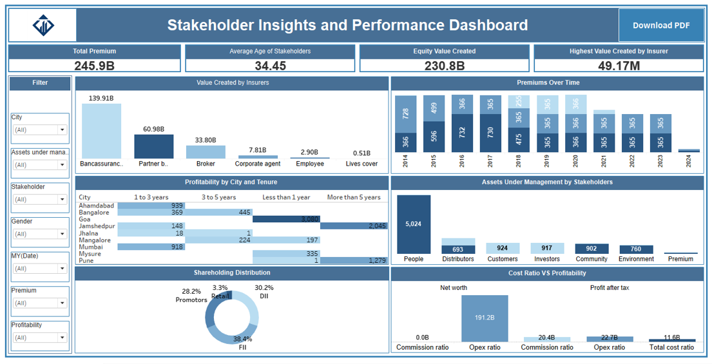

# Stakeholder Insights and Performance Dashboard Using Tableau.
## Purpose:
The dashboard will provide a comprehensive view of key business metrics and data insights related to stakeholders, insurers, and policy performance. It will enable stakeholders to analyse premium trends, profitability, and asset distribution to make data-driven decisions.

## Requirements:
## 1. Charts and Visualizations:  
•	Compare the total value created by different insurers: Displays the total value created for a comparative analysis among insurers. 
•	Display trends in premiums collected over time: Shows premium trends using line or area charts to analyse changes over time. 
•	Showcase the distribution of shareholding patterns among stakeholders: Visualizes shareholding patterns using pie or bar charts. 
•	Analyse the relationship between cost ratio and profitability: Correlation or scatter plots reveal insights between cost ratio and profitability metrics. 
•	Visualize profitability for different cities and policy tenure durations: Heatmaps or bar charts categorize profitability by city and policy tenure. 
•	Represent the distribution of assets under management across stakeholders: Bar or treemap visualizations display how assets are distributed among stakeholders. 

## 2. Key Performance Indicators (KPIs):
•	Display the total premium collected: KPI card summarizing the total amount of premiums collected. 
•	Show the average age of stakeholders: KPI card presenting the average stakeholder age. 
•	Highlight the total Value Created for insurers or stakeholders where Assets under Management is 'Equity': KPI card focusing on value creation under equity management. 
•	Identify the highest value created by a single insurer: KPI card showcasing the top-performing insurer by value created. 

## 3. Filters:
•	Filter data by city: Dropdown menu to focus data visualization on specific regions. 
•	Filter data by stakeholders: Dropdown to isolate and analyze individual stakeholder contributions. 
•	Provide a range slider to filter policies based on tenure: Interactive slider to set tenure ranges. 
•	Allow filtering of data within a specific date range: Date picker to narrow data analysis to a desired timeframe. 
•	Enable filtering by gender for demographic insights: Gender filter to separate male and female stakeholder data. 

## 4. Interactivity:
•	Enable charts to dynamically filter other visuals when clicked: Clicking a chart segment applies filters to other dashboard elements. 
•	Provide tooltips on hover to display detailed information: Rich tooltips reveal additional context, such as specific values or percentages. 
•	Ensure filters and KPIs update dynamically based on selections: All dashboard elements refresh based on applied filters or clicks. 

## 5. Export Options:
•	PDF Export Button: Dedicated button to download the dashboard as a PDF. 
•	Ensure the PDF captures all visible charts, KPIs, and filters: Export captures a snapshot of the current dashboard state. 
•	Include a light watermark with the company's branding on the exported PDF: Branding ensures a professional and consistent look. 

## Expository Structure:
•	Data: https://github.com/aparnanaik13/Data-Analysis-Dashboard/blob/main/Finance%20record.xlsx  
•	Dashboard:https://github.com/aparnanaik13/Data-Analysis-Dashboard/blob/main/Stakeholder%20Insights%20and%20Performance%20Dashboard.twbx  
•Image : 

## Feedback & Collaboration:
Your feedback is welcome! If you'd like to collaborate on similar projects or discuss data analysis opportunities,feel free to reach out.

# 📊 Stakeholder Insights & Performance Dashboard

A fully interactive business intelligence dashboard built in **Tableau Public** to help stakeholders, insurers, and decision-makers analyze key metrics like **premium trends**, **profitability**, **shareholding patterns**, and more.

 <!-- Replace with actual image path or URL if hosted -->

## 🔧 Project Requirements (Short & Focused)
✅ Visual Insights  
-Compare value created by insurers 
-Track premium trends over time 
-Visualize shareholding distribution 
-Analyze cost ratio vs. profitability 
-Show city & tenure-wise profitability 
-Display asset distribution by stakeholder 

📌 Key Metrics (KPIs)
-Total premium collected 
-Average stakeholder age 
-Value created under Equity AUM 
-Highest value by a single insurer 

## 🎛 Filters & Interactivity
-Filter by city, stakeholder, gender, date, and tenure 
-Clickable charts to update other visuals 
-Hover tooltips for deeper context 
-Real-time updates on filter changes 

🖨 Export & Access 
-Export dashboard as PDF with watermark 
-Role-based data visibility for different users 

## 🚀 Features

- 📈 **Premium Trends Visualization**
- 📊 **Cost Ratio vs. Profitability Analysis**
- 🧭 **Shareholding & Asset Distribution**
- 🏙️ **City-wise and Tenure-wise Profitability**
- 🎯 **Key Performance Indicators (KPIs)**
- 🧩 **Role-Based Data Access Simulation**
- 🖱️ **Interactive Filters & Click-to-Drill Insights**
- 🧾 **PDF Export with Branding**

## 🛠️ Tools & Technologies

- **Tableau Public**
- Data Modeling & Calculated Fields 
- UX-focused Dashboard Design 
- KPI Cards and Interactive Charts 

## 📌 Conclusion

The **Stakeholder Insights and Performance Dashboard** is a Tableau Public-based business intelligence solution that translates complex insurance and stakeholder data into intuitive, interactive visualizations. By incorporating role-based views, export functionality, and dynamic filtering, this project showcases strong skills in **data analysis**, **visual storytelling**, and **dashboard design**.

## 📂 Project Structure
-📁 Stakeholder-Dashboard: 👉 [View More](https://github.com/aparnanaik13/Data-Analysis-Dashboard/blob/main/Stakeholder%20Insights%20and%20Performance%20Dashboard.twbx)   
├── 📊 data.xlsx:  https://github.com/aparnanaik13/Data-Analysis-Dashboard/blob/main/Finance%20record.xlsx  
├── 📸 Screenshot.png:

